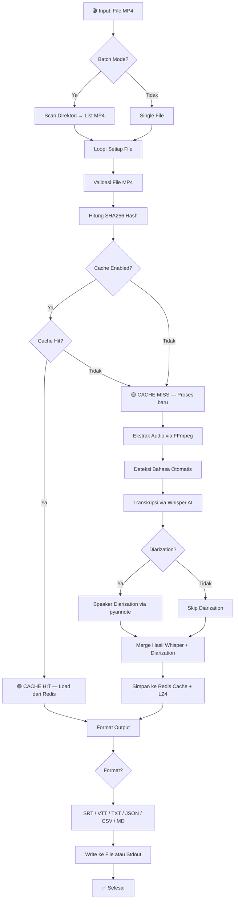
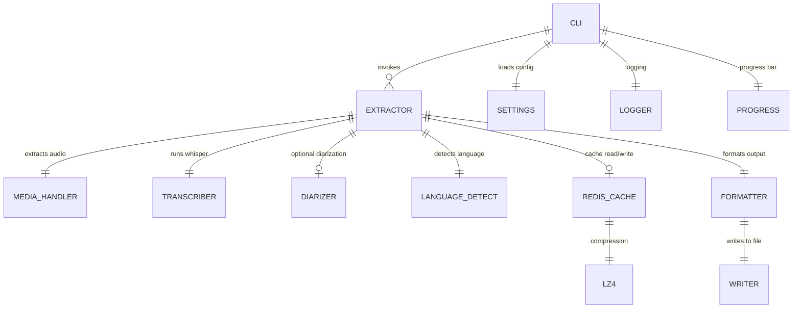

<p align="center">
  
  
  
  
  
  
  
</p>

---

<p align="center">
<pre align="center">
 _    ___     _______           _       __
| |  / (_)___/ / ___/__________(_)___  / /_
| | / / / __  /\__ \/ ___/ ___/ / __ \/ __/
| |/ / / /_/ /___/ / /__/ /  / / /_/ / /_
|___/_/\__,_//____/\___/_/  /_/ .___/\__/
                             /_/
</pre>
</p>

<h3 align="center">⚡ Advanced MP4 Transcript Extractor</h3>
<p align="center"><em>Akurat • Cepat • Multi-format • Redis Caching</em></p>
<p align="center">v1.0.0 | by <a href="https://github.com/el-pablos">el-pablos</a></p>

---

## 📖 Deskripsi Proyek

**VidScript** adalah CLI tool Python kelas profesional buat mengekstrak transkrip dari file video MP4 secara akurat dan efisien. Ditenagai oleh [Faster Whisper](https://github.com/SYSTRAN/faster-whisper) sebagai engine speech-to-text utama, VidScript bisa nge-handle mulai dari file tunggal sampai batch processing satu direktori penuh — lengkap dengan speaker diarization, deteksi bahasa otomatis, multi-format output, dan Redis caching biar nggak perlu proses ulang file yang sama.

Tool ini didesain buat siapapun yang butuh transkrip dari video: content creator, researcher, jurnalis, developer, atau siapapun yang kerja bareng konten audio/video.

---

## 🚀 Fitur Unggulan

| | Fitur | Keterangan |
|---|---|---|
| 🎙️ | **Whisper AI Transcription** | Engine transkripsi state-of-the-art dari OpenAI, support model `tiny` sampai `large-v3` |
| 🗣️ | **Speaker Diarization** | Pisahkan siapa bicara kapan pakai `pyannote.audio` — label `[SPEAKER_00]`, `[SPEAKER_01]`, dst |
| 🌍 | **Auto Language Detection** | Deteksi bahasa otomatis dari audio, atau paksa bahasa tertentu (en, id, dll) |
| 📁 | **Batch Processing** | Proses semua file `.mp4` dalam satu direktori sekaligus |
| 💾 | **Redis Caching + LZ4** | Cache hasil transkripsi dengan kompresi LZ4, TTL 7 hari (configurable) |
| 📄 | **6 Format Output** | SRT, VTT, TXT, JSON, CSV, Markdown — pilih sesuai kebutuhan |
| ⏱️ | **Timestamp Akurat** | Presisi sampai milidetik di setiap segmen |
| 🎨 | **Rich Terminal UI** | Banner ASCII art berwarna, progress bar real-time, tabel, dan status cache |
| ⚙️ | **Konfigurasi Fleksibel** | Support `.env`, CLI flags, dan file config di `~/.vidscript/config.json` |
| 📊 | **Logging Berjenjang** | DEBUG/INFO/WARNING/ERROR/CRITICAL + rotasi log harian |

---

## 🏗️ Arsitektur Proyek

VidScript dibangun dengan arsitektur berlapis yang bersih dan modular:

```
┌─────────────────────────────────────────────────────┐
│                    CLI Layer                         │
│         cli.py (Click framework + Rich UI)          │
├─────────────────────────────────────────────────────┤
│                   Core Layer                        │
│  extractor.py → transcriber.py → diarizer.py       │
│               → media_handler.py → language_detect  │
├──────────────────┬──────────────────────────────────┤
│   Cache Layer    │          Output Layer            │
│  redis_cache.py  │   formatter.py + writer.py       │
│  (Redis + LZ4)   │   (SRT/VTT/TXT/JSON/CSV/MD)     │
├──────────────────┴──────────────────────────────────┤
│                  Utils Layer                        │
│     logger.py • progress.py • helpers.py            │
├─────────────────────────────────────────────────────┤
│                 Config Layer                        │
│           settings.py + .env + config.json          │
└─────────────────────────────────────────────────────┘
```

- **CLI Layer** — Entry point utama, parsing argumen, banner display, routing subcommand
- **Core Layer** — Logika bisnis: ekstraksi audio, transkripsi Whisper, diarization, deteksi bahasa
- **Cache Layer** — Redis caching dengan kompresi LZ4 dan key berbasis SHA256 hash dari file
- **Output Layer** — Formatting ke 6 format berbeda + writing ke file/stdout
- **Utils Layer** — Logging berwarna, progress bar, dan helper functions
- **Config Layer** — Konfigurasi global dari environment variables, CLI flags, dan config file

---

## 📊 Flowchart / Diagram

### Alur Proses Transkripsi



### Arsitektur Komponen



---

## 📦 Instalasi & Quickstart

### Prasyarat

- **Python 3.10+** (tested di 3.10, 3.11, 3.12)
- **FFmpeg** — harus terinstall dan bisa diakses via PATH
- **Redis** — untuk fitur caching (opsional, bisa jalan tanpa cache pakai `--no-cache`)

### Langkah Instalasi

```bash
# 1. Clone repo
git clone https://github.com/el-pablos/video-transcript-extractor.git
cd video-transcript-extractor

# 2. Buat virtual environment
python -m venv .venv

# 3. Aktifin venv
# Windows:
.venv\Scripts\activate
# Linux/macOS:
source .venv/bin/activate

# 4. Install dependencies
pip install -e ".[dev]"

# 5. Setup file .env (WAJIB buat Redis caching)
cp .env.example .env
# Edit .env dan isi credentials Redis kamu
```

### Quickstart

```bash
# Transkrip file MP4 tunggal
vidscript transcribe video.mp4

# Transkrip dengan model yang lebih akurat + format SRT
vidscript transcribe video.mp4 --model medium --format srt

# Batch processing semua MP4 dalam folder
vidscript transcribe ./videos/ --batch --format json --output-dir ./output/
```

---

## 📝 Panduan Penggunaan

### Transkrip File Tunggal

```bash
# Basic — pakai model default (base) dan output TXT
vidscript transcribe video.mp4

# Pilih model Whisper yang lebih akurat
vidscript transcribe video.mp4 --model large-v3

# Pilih format output
vidscript transcribe video.mp4 --format srt
vidscript transcribe video.mp4 --format vtt
vidscript transcribe video.mp4 --format json
vidscript transcribe video.mp4 --format csv
vidscript transcribe video.mp4 --format md

# Tentuin bahasa secara manual
vidscript transcribe video.mp4 --language id
vidscript transcribe video.mp4 --language en

# Simpan ke file tertentu
vidscript transcribe video.mp4 --format srt --output result.srt
```

### Speaker Diarization

```bash
# Aktifin diarization — output bakal ada label [SPEAKER_00], [SPEAKER_01], dst
vidscript transcribe wawancara.mp4 --diarize --format json
```

### Batch Processing

```bash
# Proses semua file .mp4 dalam satu direktori
vidscript transcribe ./videos/ --batch --format srt --output-dir ./transcripts/
```

### Cache Management

```bash
# Lihat semua cache yang tersimpan di Redis
vidscript cache list

# Hapus semua cache
vidscript cache clear --all

# Bypass cache saat transkrip
vidscript transcribe video.mp4 --no-cache

# Set TTL cache custom (dalam detik)
vidscript transcribe video.mp4 --cache-ttl 86400
```

### Konfigurasi

```bash
# Lihat konfigurasi aktif
vidscript config show

# Set konfigurasi
vidscript config set whisper_model medium
vidscript config set output_format json
vidscript config set language id
```

### Lain-lain

```bash
# Mode verbose (DEBUG logs)
vidscript -v transcribe video.mp4

# Mode quiet (suppress semua output kecuali hasil)
vidscript -q transcribe video.mp4

# Lihat bantuan
vidscript --help
vidscript transcribe --help
```

---

## ⚙️ Konfigurasi

### CLI Flags

| Flag | Short | Default | Keterangan |
|------|-------|---------|------------|
| `--model` | `-m` | `base` | Model Whisper: `tiny`, `base`, `small`, `medium`, `large-v3` |
| `--language` | `-l` | `auto` | Kode bahasa (auto, en, id, dll) |
| `--format` | `-f` | `txt` | Format output: `srt`, `vtt`, `txt`, `json`, `csv`, `md` |
| `--output` | `-o` | — | Path file output |
| `--output-dir` | — | — | Direktori output untuk batch |
| `--diarize` | — | `false` | Aktifkan speaker diarization |
| `--batch` | — | `false` | Proses semua MP4 dalam direktori |
| `--no-cache` | — | `false` | Bypass Redis cache |
| `--cache-ttl` | — | `604800` | TTL cache dalam detik (default 7 hari) |
| `--verbose` | `-v` | `false` | Mode verbose (DEBUG level) |
| `--quiet` | `-q` | `false` | Mode quiet, output minimal |

### File `.env`

Buat file `.env` di root project:

```env
# Redis Configuration
REDIS_HOST=localhost
REDIS_PORT=6379
REDIS_DB=0
REDIS_USERNAME=default
REDIS_PASSWORD=your_redis_password_here
REDIS_CACHE_TTL=604800

# Whisper Configuration (opsional)
WHISPER_MODEL=base
WHISPER_LANGUAGE=auto

# Logging
LOG_LEVEL=INFO
```

> ⚠️ **Penting:** File `.env` TIDAK BOLEH masuk ke Git. Sudah di-handle oleh `.gitignore`.

### Config File

VidScript juga support config file di `~/.vidscript/config.json`:

```json
{
  "whisper_model": "base",
  "output_format": "txt",
  "language": "auto",
  "diarize": false,
  "cache_enabled": true
}
```

Bisa diatur via command:

```bash
vidscript config set whisper_model medium
vidscript config show
```

---

## 🧪 Testing

```bash
# Jalankan semua test
pytest tests/ -v

# Jalankan dengan coverage report
pytest tests/ --cov=vidscript --cov-report=term-missing -v

# Hasil saat ini: 269 tests passed, 94% coverage ✅
```

---

## 🗂️ Struktur Direktori

```
video-transcript-extractor/
├── vidscript/
│   ├── __init__.py              # Package init + version
│   ├── __version__.py           # Version info
│   ├── cli.py                   # Entry point CLI + banner
│   ├── core/
│   │   ├── __init__.py
│   │   ├── extractor.py         # Orchestrator utama
│   │   ├── transcriber.py       # Integrasi Whisper
│   │   ├── diarizer.py          # Speaker diarization
│   │   ├── language_detect.py   # Deteksi bahasa
│   │   └── media_handler.py     # Validasi & ekstraksi audio
│   ├── output/
│   │   ├── __init__.py
│   │   ├── formatter.py         # Format: SRT/VTT/TXT/JSON/CSV/MD
│   │   └── writer.py            # Write ke file/stdout
│   ├── cache/
│   │   ├── __init__.py
│   │   └── redis_cache.py       # Redis cache + LZ4 compression
│   ├── config/
│   │   ├── __init__.py
│   │   └── settings.py          # Konfigurasi global
│   └── utils/
│       ├── __init__.py
│       ├── logger.py            # Rich logging
│       ├── progress.py          # Rich progress bar
│       └── helpers.py           # Utility functions
├── tests/
│   ├── conftest.py              # Pytest fixtures
│   ├── test_cli.py
│   ├── test_extractor.py
│   ├── test_transcriber.py
│   ├── test_diarizer.py
│   ├── test_language_detect.py
│   ├── test_media_handler.py
│   ├── test_formatter.py
│   ├── test_writer.py
│   ├── test_redis_cache.py
│   ├── test_settings.py
│   ├── test_helpers.py
│   ├── test_progress.py
│   └── test_logger.py
├── .github/
│   └── workflows/
│       └── ci-cd.yml            # CI/CD pipeline
├── .gitignore
├── .env.example
├── pyproject.toml
├── requirements.txt
├── requirements-dev.txt
└── README.md
```

---

## 👥 Kontributor

<table>
  <tr>
    <td align="center">
      <a href="https://github.com/el-pablos">
        
        <br />
        <sub><b>el-pablos</b></sub>
      </a>
      <br />
      💻 🎨 📖
    </td>
  </tr>
</table>

---

## 📜 Lisensi

Proyek ini dilisensikan di bawah **MIT License** — bebas dipakai, di-modif, dan didistribusikan.

Lihat file [LICENSE](LICENSE) untuk detail lengkap.

---

## 📊 Statistik Repo

<p align="center">
  
</p>

<p align="center">
  
  
  
  
</p>

---

<p align="center">
  <b>VidScript</b> — Built with ❤️ and ☕ by <a href="https://github.com/el-pablos">el-pablos</a>
</p>
